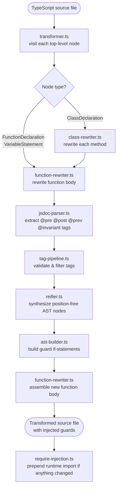
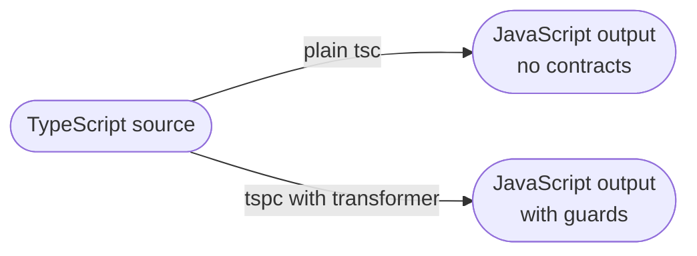

# Transformation Pipeline

How a single annotated function goes from TypeScript source to compiled JavaScript with injected guards.

---

## High-level flow



---

## Step-by-step: a single function

Given this source:

```typescript
/**
 * @pre amount > 0
 * @pre amount <= this.balance
 * @post result === this.balance
 */
public withdraw(amount: number): number {
  this.balance -= amount;
  return this.balance;
}
```

### 1. Visit (`transformer.ts`)

The file visitor walks top-level AST nodes. It reaches the enclosing `ClassDeclaration` and routes it to `class-rewriter.ts`, which then calls `function-rewriter.ts` for each public method.

### 2. Resolve reparsed node (`reparsed-index.ts`)

The original AST node has no parent links, so `getJSDocTags()` returns nothing. The transformer looks up the reparsed counterpart (same file, re-parsed with `setParentNodes: true`) by source position.

### 3. Extract tags (`jsdoc-parser.ts`)

Tags are read from the reparsed node:

```
pre  → "amount > 0"
pre  → "amount <= this.balance"
post → "result === this.balance"
```

### 4. Validate and filter (`tag-pipeline.ts`, `contract-validator.ts`)

Each expression is parsed and checked:
- All referenced identifiers must be known (parameters, `this`, `result`, `prev`, or type-checker scope).
- `result` in a `@post` on a `void` function is dropped with a warning.
- `prev` without a `@prev` tag on a method auto-generates `const __axiom_prev__ = { ...this }`.

### 5. Synthesize expressions (`reifier.ts`)

Each tag expression string is parsed into an AST via a temporary source file, then re-built using factory calls to strip source positions. The resulting nodes are safe to emit into the output file.

### 6. Build guards (`ast-builder.ts`)

For each pre-tag, one `if` statement:

```typescript
if (!(amount > 0)) {
  throw new ContractViolationError('PRE', 'amount > 0', 'Account.withdraw');
}
```

For post-tags, the original body is wrapped in an IIFE so the return value can be captured:

```typescript
const __axiom_result__ = (() => {
  this.balance -= amount;
  return this.balance;
})();
if (!(__axiom_result__ === this.balance)) {
  throw new ContractViolationError('POST', 'result === this.balance', 'Account.withdraw');
}
return __axiom_result__;
```

### 7. Reassemble the function (`function-rewriter.ts`)

The statements are collected in order — pre-guards, optional `prev` capture, body capture IIFE, post-guards, invariant call (if any), return — and placed into a new `Block` via `factory.updateMethodDeclaration`.

### 8. Prepend runtime import (`require-injection.ts`)

If any node in the file was rewritten, a `require('@fultslop/axiom')` statement is prepended to the output so `ContractViolationError` and `InvariantViolationError` are in scope at runtime.

---

## Release build path

When `keepContracts` is `false` (the default for a plain `tsc` build without the transformer plugin), the transformer is not loaded at all. No guards are injected and the output is identical to what `tsc` would produce — no runtime overhead, no references to the axiom package.


