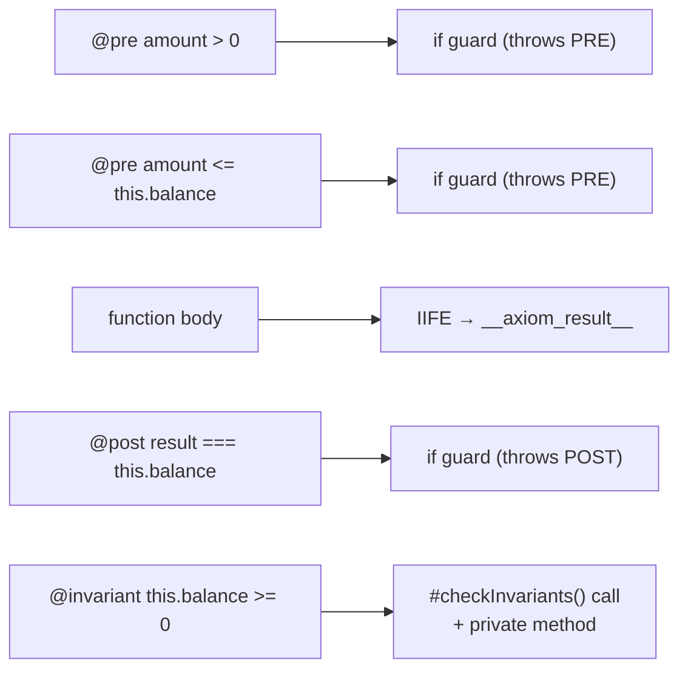

# Transformation Example

A concrete before-and-after showing exactly what the transformer injects.

---

## Source (TypeScript)

```typescript
import { ContractViolationError, InvariantViolationError } from '@fultslop/axiom';

/**
 * @invariant this.balance >= 0
 */
export class Account {
  public balance: number;

  constructor(initial: number) {
    this.balance = initial;
  }

  /**
   * @pre amount > 0
   * @pre amount <= this.balance
   * @post result === this.balance
   */
  public withdraw(amount: number): number {
    this.balance -= amount;
    return this.balance;
  }
}
```

---

## What the transformer does



Each `@pre` becomes an `if` guard before the body. The body is wrapped in an IIFE so its return value is captured as `__axiom_result__`. Each `@post` becomes an `if` guard after. The invariant is checked by a generated `#checkInvariants()` call at every public method exit.

---

## Output (JavaScript, dev build)

```javascript
const { ContractViolationError, InvariantViolationError } = require('@fultslop/axiom');

export class Account {
  balance;

  constructor(initial) {
    this.balance = initial;
    this.#checkInvariants('Account');
  }

  withdraw(amount) {
    // --- injected @pre guards ---
    if (!(amount > 0)) {
      throw new ContractViolationError('PRE', 'amount > 0', 'Account.withdraw');
    }
    if (!(amount <= this.balance)) {
      throw new ContractViolationError('PRE', 'amount <= this.balance', 'Account.withdraw');
    }

    // --- body wrapped in IIFE to capture return value ---
    const __axiom_result__ = (() => {
      this.balance -= amount;
      return this.balance;
    })();

    // --- injected @post guard (result = __axiom_result__) ---
    if (!(__axiom_result__ === this.balance)) {
      throw new ContractViolationError('POST', 'result === this.balance', 'Account.withdraw');
    }

    // --- injected @invariant check ---
    this.#checkInvariants('Account.withdraw');

    return __axiom_result__;
  }

  // --- generated by the transformer ---
  #checkInvariants(location) {
    if (!(this.balance >= 0)) {
      throw new InvariantViolationError('this.balance >= 0', location);
    }
  }
}
```

---

## Release build output (plain `tsc`)

The transformer is not loaded. Output is identical to what TypeScript would produce without Axiom — no guards, no import, no `#checkInvariants`:

```javascript
export class Account {
  balance;

  constructor(initial) {
    this.balance = initial;
  }

  withdraw(amount) {
    this.balance -= amount;
    return this.balance;
  }
}
```

---

## Async function example

`result` in a `@post` refers to the **resolved** value, not the `Promise`.

**Source:**
```typescript
/**
 * @pre id > 0
 * @post result !== null
 */
export async function findUser(id: number): Promise<User> {
  return db.query(id);
}
```

**Output:**
```javascript
async function findUser(id) {
  if (!(id > 0)) {
    throw new ContractViolationError('PRE', 'id > 0', 'findUser');
  }
  const __axiom_result__ = await (async () => {
    return db.query(id);
  })();
  if (!(__axiom_result__ !== null)) {
    throw new ContractViolationError('POST', 'result !== null', 'findUser');
  }
  return __axiom_result__;
}
```

The IIFE is `async` and is `await`ed so `__axiom_result__` holds the resolved `User`, not a `Promise<User>`.

---

## `@prev` state capture

**Source:**
```typescript
/** @post this.balance === prev.balance + amount */
public deposit(amount: number): void {
  this.balance += amount;
}
```

**Output:**
```javascript
deposit(amount) {
  // auto-injected because @post references prev and no @prev tag is present
  const __axiom_prev__ = ({ ...this });

  const __axiom_result__ = (() => {
    this.balance += amount;
  })();

  if (!(this.balance === __axiom_prev__.balance + amount)) {
    throw new ContractViolationError('POST', 'this.balance === prev.balance + amount', 'Account.deposit');
  }
  return __axiom_result__;
}
```

`prev` in the `@post` expression is rewritten to `__axiom_prev__` during code generation. The shallow clone (`{ ...this }`) is injected automatically for methods; provide an explicit `@prev <expression>` tag to override.
